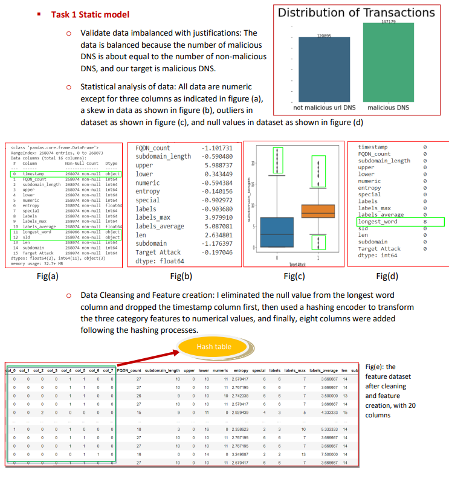
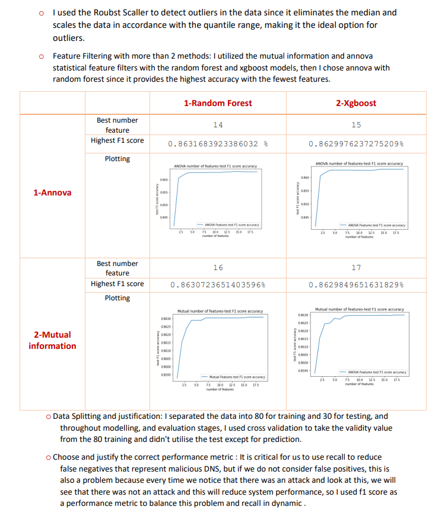
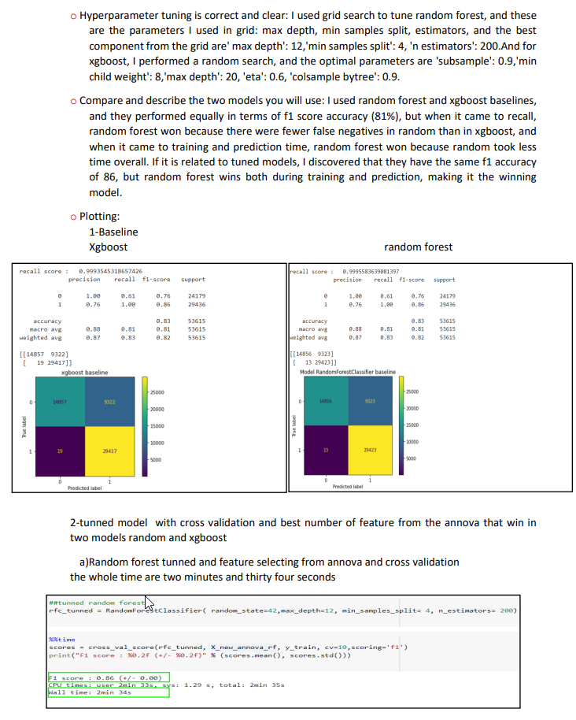
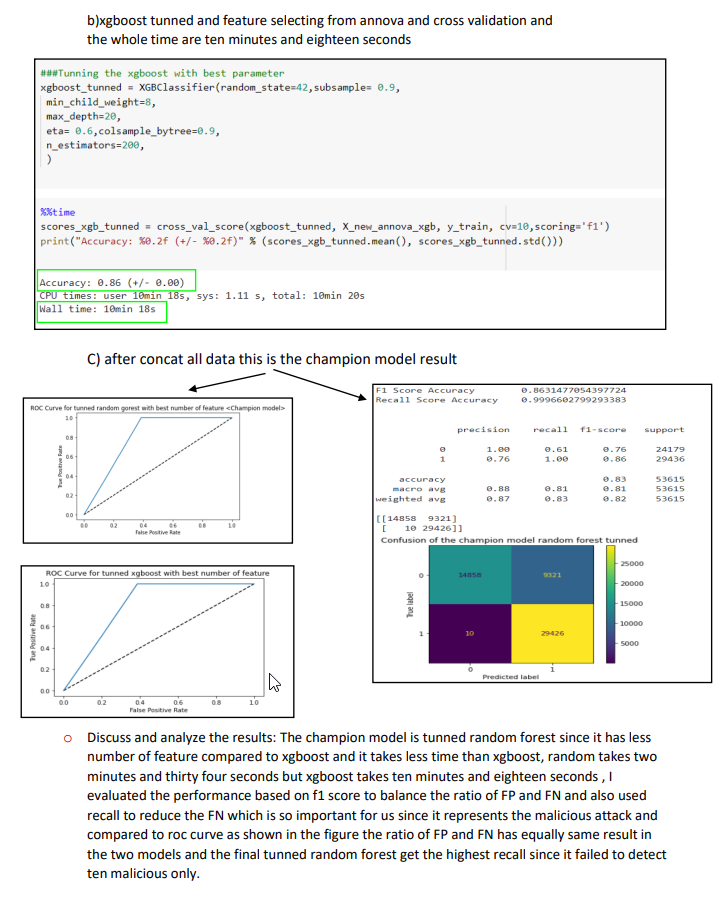
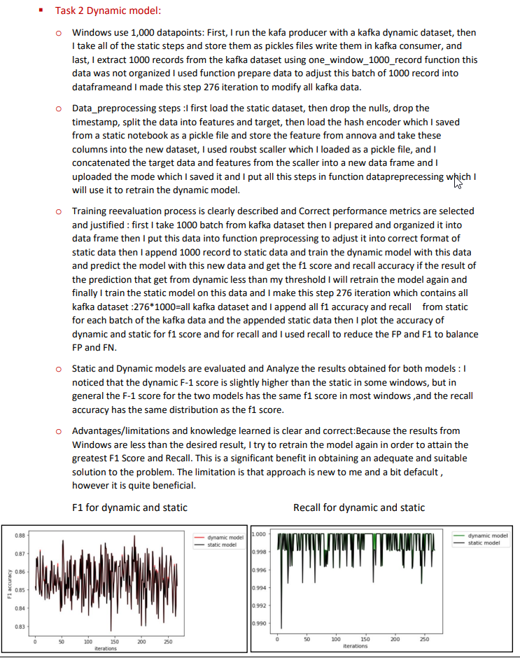

# Intrusion-Detection-over-Kafka-stream
Kafka stream,ML

I constructed a binary classifier with the intention of predicting data exfiltration via DNS.  Two tasks will be required. I used two predictive modeling techniques: a static model and another that changes over time.
We will have 2 separate datasets for each task, which should be handled as follows:
• A "static_dataset.csv" file for training a static model. 
• "kafka_dataset.csv" file, which you should treat as a data stream (on a local Kafka Server), and which will be used to assess the dynamic model. 

    

    

    

    

